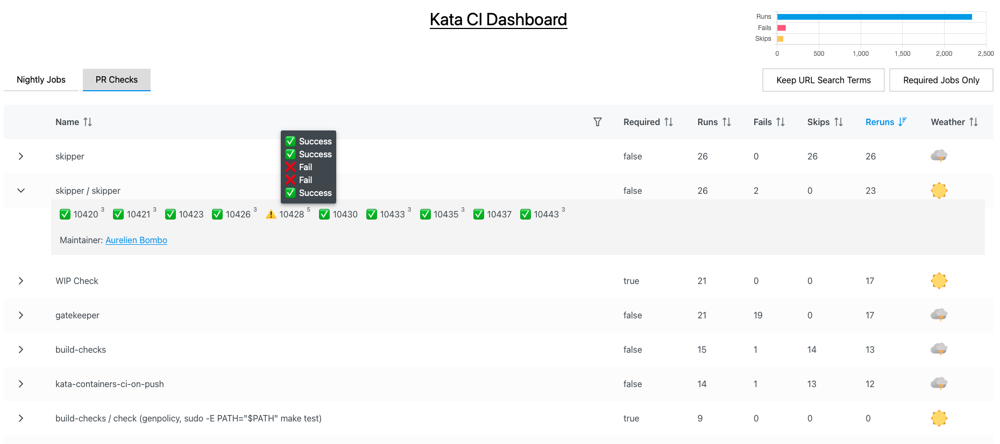

## Collaborators

| Names             | Roles   | Emails                       | GitHub Handles |
| :---------------- | ------- | ---------------------------- | -------------- |
| Aurelien Bombo    | Mentor  | aurelien.bombo@microsoft.com | sprt           |
| Archana Choudhary | Mentor  | archana1@microsoft.com       | arc9693        |
| Saul Paredes      | Mentor  | saulparedes@microsoft.com    | Redent0r       |
| Anna Finn         | Student | afinn12@bu.edu               | afinn12        |
| James Knee        | Student | jknee@bu.edu                 | JamesKnee      |
| Chris Krenz       | Student | ckrenz@bu.edu                | chris-krenz    |
| Alicja Mahr       | Student | alicja@bu.edu                | a1icja         |
| Xiteng Yao        | Student | xtyao@bu.edu                 | xtyao66        |

## Other Relevant Repositories
- [Original Dashboard Repo](https://github.com/kata-containers/kata-containers.github.io)
- [Forked Dashboard Repo](https://github.com/a1icja/kata-dashboard-next) (work mostly done here, PR into original)
- [Old Forked Dashboard Repo](https://github.com/afinn12/portersrc.github.io) (before switch to React/Next.js, stale)

## Sprint Demo Videos

1. [Sprint 1 Video](https://drive.google.com/file/d/1We9vtgX5poMUT0BkioDxLE8eoD2TF5NO/view?usp=sharing)
2. [Sprint 2 Video](https://drive.google.com/file/d/15YUULSI2Xe6KHCUbwtsGrMwh4HszdG7H/view?usp=sharing)
3. [Sprint 3 Video](https://drive.google.com/file/d/1qCYdzWGJTecCp1liND09Lp17qN61Xw_1/view?usp=sharing)
4. Due by Wednesday, November 6th/November 13th
5. Due by Wednesday, November 20th/Monday, November 25th

## Sprint Demo Slides

1. [Sprint 1 Slides](https://docs.google.com/presentation/d/1YY3hOz72ddWBu9trWHyxlHmOa4Xpm7kRqmj7HP0JlaQ/edit#slide=id.g304af07303f_6_6)
2. [Sprint 2 Slides](https://docs.google.com/presentation/d/11SlJg44mNMW-6hoD_dekvK64vk646ftpcA0L6TzLGWY/edit?usp=sharing)
3. [Sprint 3 Slides](https://docs.google.com/presentation/d/1zIPiGBRkyaaVgajAXlqNz-Tdb6NFuN7FT9XffjaEJI0/edit?usp=sharing)
4. Due by Wednesday, November 6th/November 13th
5. Due by Wednesday, November 20th/Monday, November 25th

## Final Presentation

1. Due by Monday, December 9th/Wednesday, December 11th

## 1.   Vision and Goals Of The Project:

Kata Containers is an open-source community working to build a secure container runtime with lightweight virtual machines that feel and perform like containers but provide stronger workload isolation using hardware virtualization technology as a second layer of defense.

As Kata Containers support many different systems, architectures, hypervisors, and other underlying technologies, CI (continuous integration) along with a stable and automated test environment are paramount to the project's success. As such, the community is continuously investigating ways to strengthen our testing pipelines and make our processes more efficient.

To that end, the goals of this project are to:

1. Implement improvements to the recently developed [Kata CI Dashboard](https://kata-containers.github.io/) to visualize CI runs, improve the clarity of the dashboard feedback, and better assess the health of the testing infrastructure
2. Develop a plan for—and a cost estimate of—implementing a CI GitHub Bot for Kata Containers that would help Kata Container developers automate a variety of tasks and run commands via GitHub comments
3. And, if time permits, implement the GitHub Bot along with a variety of commands that facilitate CI development and transparency

**Note**: Since the original project proposal, the Kata CI Dashboard was released recently and has become a focal point of the community's efforts to improve Kata Container CI/CD.  The dashboard offers a timely and valuable opportunity to deliver impactful CI/CD functionality to the developer community.  As such, we initially prioritized dashboard development over the original objective of GitHub Bot development, but the latter remains an important project goal.

A high level overview of the project can be found in the following diagram:

This essentially shows the 4 key components of the system:

* GitHub where PR checks and Nightly (or other) CI tests are initiated
* CI Dashboard where test statuses and related data can be viewed
* Test Environments where the Kubernetes clusters and Kata containers run
* Prow—a Kubernetes-based CI/CD pipeline—that facilitates communication between GitHub and the test environments (Prow enables features like allowing developers to rerun specific tests by adding comments to PRs)

These features are discussed further below.

## 2. Users/Personas Of The Project:

The typical user will be a developer of Kata Containers who is utilizing GitHub-based CI/CD.  More specifically, there are non-maintainers/regular developers and then maintainers/reviewers. Non-maintainers have fewer permissions and any time they update or push code their work needs to be checked before it is run through the testing pipeline.  This is in contrast to maintainers who could be seen more as admins of the system. They ensure code quality as well as review merge requests and pull requests.

Both of these user groups require a UI and tools to easily view and assess the results of their CI tests, though their use cases may differ somewhat.  Maintainers may find it especially useful to have Dashboard features that monitor the health and status of all tests at merge time.  Other (non-maintainer) developers, who are not directly responsible for approving pull requests or performing merges, may find more utility in commands that can be run prospectively to assess code quality, etc.  Maintainers will be more interested in running all available tests (at least the required tests) to ensure code compatitilbity and stability, whereas non-maintainer developers may prefer to zoom in on specific tests that relate to the particular features they are implementing. Regardless, all tools—both GitHub commands and Dashboard features—will be available to and useful for any Kata Containers developer.

Critical to this project will be the team's ability to communicate and coordinate with the broader Kata Containers developer community in order to identify and properly define the features that will be most useful to the community.  This process of brainstorming and detailed specification/operationalization can be helpful for the community's future development, even for features we are not able to implement ourselves.  To this end, the student team has presented to two developer communities, beyond their core group of mentors:

* [Cloud Native Computing Foundation](https://www.cncf.io/about/who-we-are/) confidential containers (CoCo) )meeting on October 9, 2024
* OpenInfra Foundation's Project Teams Gathering ([PTG](https://openinfra.dev/ptg/)) meeting on October 21, 2024

At the former meeting, the team presented two options for the CI Dashboard architecture: sticking with the original jQuery implementation or upgrading to Next.js/React.  These options are discussed further in the next section.  During the CoCo meeting, the community approved the team's transition to Next.js/React, which is the architecture the team will further pursue going forward.

## 3.   Scope and Features Of The Project:

The Dashboard repo is currently located [here](https://github.com/kata-containers/kata-containers.github.io), though the student team started implementing these features in two separate repos:

* [Repo](https://github.com/afinn12/portersrc.github.io) with upgrades to the original jQuery (and HTML/CSS) architecture
* [Repo](https://github.com/a1icja/kata-dashboard-next) with the Next.js/React implementation of the dashboard (deployed Dashboard is accessible [here](https://a1icja.github.io/kata-dashboard-next/))

These versions were initially created so the students could explore both implementations—jQuery and Next.js/React—identify the pros/cons of each, and present the two options to the community.  jQuery is a fast, lightweight JS library (simplifies DOM/event manipulations); Next.js is a React-based framework for server-rendered, static, or hybrid web apps; and React is a JS library for UIs with reusable components & declarative style.  Each implementation has its own advantages and disadvantages, but Next.js/React were ultimately chosen, largely to increase development velocity and avoid reinventing the wheel (through the use of pre-defined React components).

Currently, the Dashboard runs on a static GitHub Pages page and displays data on both: 1) a battery of tests run Nightly and 2) checks that are run on certain PRs.  The GitHub Bot/Prow are not currently implemented but are being planned.

Here are the features we are currently have implemented or plan to implement.

***Dashboard:***

- [x] Switch to React/Next.js
- [ ] Implement a tree view
- [x] Implement a way to filter based on URL
  - [x] Tie filter box in table to URL search function
- [x] Implement a way to only take into account required tests
  - [x] Added filter/sort for required tag
  - [ ] Indicate how many required/non-required tests were passed
- [x] Implement a feature to collapse and expand data regarding each test
- [ ] Implement new views/indexing (currently nightly results indexed by test name):
  - [x] New: PR results indexed by test name
  - [ ] New: Test results indexed by nightly run
  - [ ] New: Test results indexed by PR run
  - [ ] NEW: Single PR view
- [ ] Add Maintainers list (group to contact about test)
  - [ ] Design backend/create groupings
- [x] Indicate if test was rerun
  - [x] Add number of reruns in dropdown menu
    - [x] Add individual results of reruns in dropdown menu
  - [x] Add info to table column
- [ ] Add ok-to-test-tdx label
- [ ] Add ability to configure how many runs to display
- [ ] Make documentation so that dashboard can be applied to any repo
- [ ] Implement graphs (stretch goal)

Here is an example screenshot of the current Next.js/React Dashboard:

***CI Bot Automation/Commands:***

  - [x] Early draft proposal for Prow implementation
  - [ ] Finalize proposal for how to implement a GitHub bot (likely with Prow; will require hosting)
  - [ ] Automatically add the ok-to-test label to PRs from maintainers
  - [ ] Automatically remove the ok-to-test label after every push to increase security (for non-maintainers)
  - [ ] Implement labels that trigger specific subsets of tests (e.g. ok-to-test-perf)
  - [ ] Implement commands to set such labels via GitHub comments (stretch goal)

## 4. Solution Concept

In terms of the Dashboard, we plan to leverage the existing [Kata Containers CI Dashboard](https://kata-containers.github.io/) to add the desired changes/functionality. In terms of implementation, we will create a testing PR labeling system. This would allow users to:

* Group tests into specific categories
* Display required tests while hiding less important tests
* Set which tests to be run for which PRs

In general, we will reference the CI pipeline that was just run for a given job and then add the corresponding results to the Dashboard. When doing this we will give the entries different properties and labels that allow us to develop different ways of viewing the information. The labels, including the ones mentioned above, would have to be implemented in the CI pipeline automation.

In terms of the CI Automation and GitHub Bot, we plan to use [Prow](https://docs.prow.k8s.io/docs/getting-started-deploy/)—a Kubernetes based CI/CD system.  However, this is deployed in a Kubernetes cluster and so will require hosting with a cloud provider.  Since this comes with a non-negligible cost, one of our first goals will be to assess this cost and flesh out the implementation details.  Our current plan is to use Azure Kubernetes Service, as Microsoft is already sponsoring the Kata project.

Prow allows users to trigger jobs from various types of events and report their status to many  different services. Critically, Prow also provides GitHub automation in the form of policy enforcement, chat-ops via /foo style commands, and automatic PR merging.  These features make Prow a perfect fit for the current project.

Here is a draft of our initial plans for how to deploy Prow:

1. Set Up Kubernetes Cluster on Azure

   * I have already tested with a very simple hello world program
2. Deploy Prow Components

   * Need to configure prow’s components including hook, plank, deck, and tide
   * Need to monitor and log the health of Prow
3. Configure GitHub Integration

   * Create a Github app and link it to Prow’s hook
   * Will require proper authentication to ensure that prow will not be triggered incorrectly
4. Implement CI/CD Pipelines

   * Should be able to automatically test and build kata containers on branch changes
   * Maybe able to reuse the existing CI/CD workflow
5. Set Up a Database for CI/CD Results

   * A database will be needed to store the CI/CD results
   * Potentially use Azure Cosmos DB or table DB
6. Show the Pipeline results on our webpage

   * May use Prow’s deck component to show results directly
   * Need to set up DB access for more advanced operations

See the images below for an overview of the architectures for both Kata Contains and Prow.

#### Kata Containers Overview

This diagram shows a basic Kata Containers architecture.  Unlike traditional containers, Kata Containers run inside lightweight VMs.

Inside each VM, an agent runs, managing container processes inside the VM. The agent receives gRPC calls from the Kata Shim to perform actions like starting or stopping containers.

Here is a summary of each component:

* Kubernetes: Manages the lifecycle of containers using the OCI (Open Container Initiative).
* Kata Shim V2: Acts as a proxy between the Kubernetes container runtime and the virtual machine running the container. OCI commands/specs are passed from Kubernetes to the Kata Shim, which translates them into gRPC calls (or Google Remote Procedure Calls–a modern, high-performance, open-source framework for inter-process communication (IPC) between applications.)
* Hypervisor: Kata Containers rely on a hypervisor (we will be using QEMU) to manage the lightweight VMs, ensuring strong isolation and superior security compared to a traditional container.
* VSOCK: Enables fast and secure communication between the Kata Shim and the VM, bypassing traditional networking overhead and efficient gRPC communication between the Kubernetes runtime (outside) and the agent inside the VM.

In summary:

* Kubernetes sends container commands.
* Kata Shim V2 translates those commands into gRPC calls for the VM.
* The agent inside the VM runs container workloads within lightweight VMs for enhanced security.
* VSOCK provides efficient communication between the Kata Shim and the VM.

#### Prow Overview

This diagram illustrates how Prow integrates GitHub, Kubernetes, and various plugins to automate continuous integration (CI) tasks like testing, retesting, reporting, and merging PRs.

An example Prow flow would be:

1. PR Created: A contributor opens a PR in the Kata Containers GitHub repo.
2. Prow Triggers Tests: Prow automatically triggers CI jobs defined for Kata Containers (e.g., tests that run Kata Containers on different configurations).
3. Bot Feedback: The Prow GitHub bot comments on the PR with test results. Developers can use bot commands (e.g., /retest) to interact with it.
4. Merge After Approval: Once tests pass and approvals are obtained (e.g., via /approve), Prow can merge the PR automatically.

The different pieces of the diagram can be understood as follows:

* GitHub Interaction:
  * Webhooks trigger actions when pull requests (PRs) are opened, commented on, or updated.
  * GitHub commands like /retest or /meow (which are handled by Prow plugins) can be used in PR comments to trigger certain CI/CD workflows.
* Prow Components:
  * Webhook Handler: Receives webhooks from GitHub and forwards them to Prow for further actions.
  * Tide: Handles retesting and automatic merging of PRs if all conditions are met.
  * Crier: Reports status and results (e.g., pass/fail) back to GitHub.
  * Horologium: Manages scheduled jobs, creating new ones at specific intervals.
  * Sinker: Cleans up old jobs and resources, such as Pods, after they are no longer needed.
* Job Management:
  * Prowjobs: A key concept in Prow. These are Kubernetes CRDs (Custom Resource Definitions) that define and track the CI/CD jobs.
  * Build Cluster: Where the actual job execution (e.g., running tests in Pods) happens.
  * Pods: The jobs are run as Pods inside the Kubernetes cluster.
* Deck: The dashboard for visualizing job status and results.

## 5. Acceptance criteria

These features are elaborated on in greater detail in **Section 3** above.  This section provides a brief summary of the features.

#### Minimum Viable Product:

* CI Dashboard:
  * New filtering, sorting, and search options
  * PR data
  * Additional info, such as maintainer info
* CI Automation
  * Implementation of additional PR labels that control CI tests
  * A detailed plan for how our team—or the community—can implement a GitHub Bot and associated CI/CD commands

#### Stretch Goals:

* Dashboard
  * Implement graphs
  * Implement a tree view
* CI Automation and GitHub Bot
  * Implement a basic backend to manage data fetching
  * Implement Prow
  * Implement commands to set labels via GitHub comments

## 6.  Release Planning:

We plan on 5 major releases, corresponding to the 5 planned sprints throughout the semester:

1. Project setup, implementation of and experimentation with Kata Containers, skeletons of planned Dashboard features, and basic research on a potential Bot implementation
2. Substantive improvements to existing CI Dashboard (visualizations and health checks) and research into a GitHub Bot implementation
3. Creation of placeholder GitHub Bot and further improvements to the Dashboard
4. Implement labels for the PRs and, if time permits, implementation of GitHub Bot commands
5. Finalize and test features

## Resources

* Kata board: [https://github.com/orgs/kata-containers/projects/49/views/1](https://github.com/orgs/kata-containers/projects/49/views/1)
* Dashboard code: [https://github.com/kata-containers/kata-containers.github.io](https://github.com/kata-containers/kata-containers.github.io)
* Kubernetes and containers: [https://kubernetes.io/](https://kubernetes.io/)
* Kata containers: [https://katacontainers.io/learn/](https://katacontainers.io/learn/)
* Kata repo:  [https://github.com/kata-containers/kata-containers](https://github.com/kata-containers/kata-containers)
* Installation guide: [https://github.com/kata-containers/kata-containers/tree/main/docs/install](https://github.com/kata-containers/kata-containers/tree/main/docs/install)
* Community info (incl. weekly meeting and Slack channels): [https://github.com/kata-containers/community](https://github.com/kata-containers/community)
* Architecture: [https://github.com/kata-containers/kata-containers/tree/main/docs/design/architecture](https://github.com/kata-containers/kata-containers/tree/main/docs/design/architecture)
* Architecture 3.0: [https://github.com/kata-containers/kata-containers/tree/main/docs/design/architecture_3.0](https://github.com/kata-containers/kata-containers/tree/main/docs/design/architecture_3.0)
* Contributing guide: [https://github.com/kata-containers/community/blob/main/CONTRIBUTING.md](https://github.com/kata-containers/community/blob/main/CONTRIBUTING.md)
* Patch format: [https://github.com/kata-containers/community/blob/main/CONTRIBUTING.md#patch-format](https://github.com/kata-containers/community/blob/main/CONTRIBUTING.md#patch-format)
* CI guide: [https://github.com/kata-containers/kata-containers/blob/main/ci/README.md](https://github.com/kata-containers/kata-containers/blob/main/ci/README.md)
* Prow: [https://docs.prow.k8s.io/docs/getting-started-deploy/](https://docs.prow.k8s.io/docs/getting-started-deploy/)

---

## About

This is a project for BU EC528: Cloud Computing Fundamentals that is intended to implement a GitHub bot for the Kata Containers CI to automate various tasks, as well as implement improvements to the existing [Kata Containers CI Dashboard](https://kata-containers.github.io/).

## Installation

Kata Containers: [https://github.com/kata-containers/kata-containers/pull/10335](https://github.com/kata-containers/kata-containers/pull/10335)

The installation and running of the CI Dashboards are discussed further in those repos:

* Current Kata Dashboard [repo](https://github.com/kata-containers/kata-containers.github.io)
* Next.js/React Dashboard [repo](https://github.com/a1icja/kata-dashboard-next) that will ultimately replace the jQuery version

## License

[CC0 1.0 Universal](https://github.com/EC528-Fall-2024/github-bot-kata-ci/blob/main/LICENSE)
